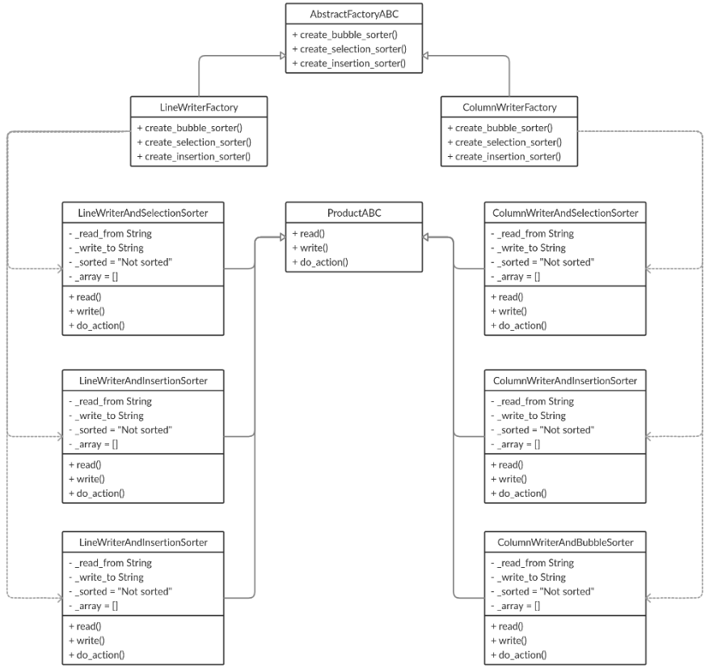

# abstract-factory-and-sorting

## [OTUS](https://otus.ru) homework

### Goals
Implement OOP pattern "Abstract factory"

### Description
There is a program which reads an array from one file and writes it to another file. 
There are some methods to do it. The program can write array in line or column and use
bubble, selection or insertion sort.

### Class schema



### Abstract factory
Clients code uses method **get_program** to get the program class with need methods implementation.
```python
program_class = get_program(writer_type, sort_type)
```
**get_program** method takes two parameters **writer_type** and **sort_type**. 
Client will get need program class depends on arguments.

To run program:
```bash
$ python start.py
```

To run tests:
```bash
$ python -m unittest tests
```
